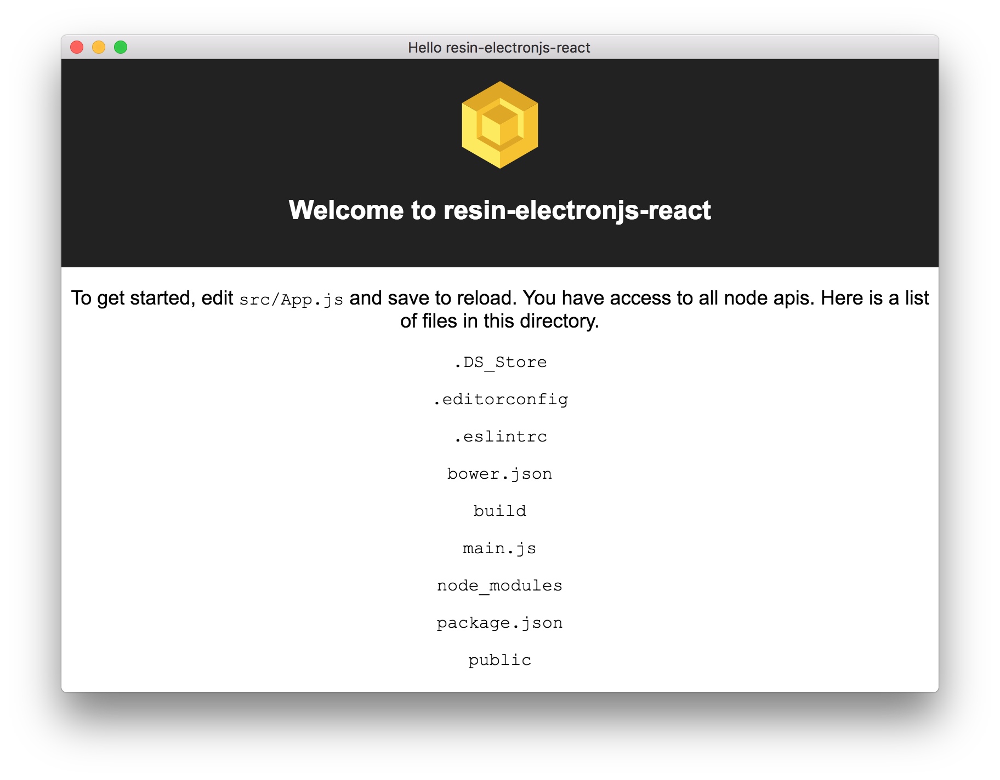

**This is a react.js fork of resin-electronjs**

It uses [create-react-app](https://github.com/facebookincubator/create-react-app) to handle the configuration and provide a simple starting point for resin.io + electron + react projects.

This fork is preconfigured to run the node launcher, so `URL_LAUNCHER_NODE` is always set to `1`.



# resin-electronjs

a boilerplate for developing kiosks, digital signage or other human-machine interaction projects based on [ElectronJS](http://electron.atom.io/) and [resin.io](http://resin.io)

## Warning regarding armv6
This project does not currently support the armv6 architecture (ie Raspberry Pi 0 and 1) due to electron limitations. If the issue is fixed on the electron side, we will include it in this project. More on this [here](https://github.com/electron/electron/issues/4677)

## Getting started

- Sign up on [resin.io](https://dashboard.resin.io/signup)
- go throught the [getting started guide](http://docs.resin.io/raspberrypi/nodejs/getting-started/) and create a new application
- clone this repository to your local workspace
- add the _resin remote_ to your local workspace using the useful shortcut in the dashboard UI 
- `git push resin master`
- see the magic happening, your device is getting updated Over-The-Air!

## Configure via [environment variables](https://docs.resin.io/management/env-vars/)
Variable Name | Value | Description | Device-specific
------------ | ------------- | ------------- | -------------
**`RESIN_HOST_CONFIG_gpu_mem`** | a value from `64` to `160` | the amount of RAM dedicated to the GPU | Raspberry Pi (all revs)

Apply the above settings in the "Fleet Configuration" panel (if applying it for the all devices withing your application), or "Device Configuration" panel (if applying it for a single device).


### WHY THIS TEMPLATE

Achieving kinda-smooth desktop application display on devices like the raspberrypi is hard. This project aims to provide a quickstart template.

### URL LAUNCHER config via ENV VARS
*__!!! Please note that since `0.1.0` the `bool`-based env vars dropped `true` / `false` strings in favour of `0` / `1` ones. !!!__*

simply set these [environment varables](http://docs.resin.io/#/pages/management/env-vars.md) in your app via "Environment Variables" panel in the resin dashboard to configure the behaviour of your devices.
*__Please note that the `bool` type definition in the table is meant to accept to either `0` or `1` values.__*

* **`URL_LAUNCHER_URL`** *string* - the URL to be loaded. use `file:////usr/src/app/data/index.html` to load a local electronJS (or any website) app - *defaults to* `file:////usr/src/app/data/index.html`
* **`URL_LAUNCHER_NODE`** *bool* (converted from *string*) - whether or not enable nodejs - *defaults to* `0`
* **`URL_LAUNCHER_KIOSK`** *bool* (converted from *string*) - whether or not enter KIOSK mode - *defaults to* `1`
* **`URL_LAUNCHER_TITLE`** *string* - the title of the window. Seen only with `URL_LAUNCHER_FRAME`=`true` - *defaults to* `RESIN.IO`
* **`URL_LAUNCHER_FRAME`** *bool* (converted from *string*) - set to "true" to display the window frame. Seen only with `URL_LAUNCHER_KIOSK`=`false` - *defaults to*  `0`
* **`URL_LAUNCHER_CONSOLE`** *bool* (converted from *string*) - set to "true" to display the debug console -  *defaults to*  `0`
* **`URL_LAUNCHER_WIDTH`**  *int* (converted from *string*) -  - *defaults to* `1920`
* **`URL_LAUNCHER_HEIGHT`**  *int* (converted from *string*) -  - *defaults to* `1080`
* **`URL_LAUNCHER_TOUCH`** *bool* (converted from *string*) - enables touch events if your device supports them  - *defaults to* `0`
* **`URL_LAUNCHER_TOUCH_SIMULATE`** *bool* (converted from *string*) - simulates touch events - might be useful for touchscreen with partial driver support - be aware this could be a performance hog  - *defaults to* `0`
* **`URL_LAUNCHER_ZOOM`** *float* (converted from *string*) - The default zoom factor of the page, 3.0 represents 300%  - *defaults to* `1.0`
* **`URL_LAUNCHER_OVERLAY_SCROLLBARS`** *bool* (converted from *string*) - enables overlay scrollbars  - *defaults to* `0`
* **`TFT`** *bool* (converted from *string*) - sets the target display to TFT screen like the [piTFT](https://www.adafruit.com/product/1601) but still requires you to set the proper device tree overlay configuration for it  - *defaults to* `0`
* **`TFT_ROTATE`**  *int* (converted from *string*) - accepted values: 0,90,180,270 - *defaults to* `0`
* **`ELECTRON_ENABLE_HW_ACCELERATION`**  *bool* (converted from *string*) - enable hardware acceleration - *defaults to* `0`
* **`ELECTRON_RESIN_UPDATE_LOCK`**  *bool* (converted from *string*) - Enable supervisor update locking (see [Update Locking](#update-locking))
* **`ELECTRON_APP_DATA_DIR`**  *string* - Override the `appData` directory (see [Electron API Documentation: app](https://electronjs.org/docs/api/app#appgetpathname))
* **`ELECTRON_USER_DATA_DIR`**  *string* - Override the `userData` directory (see [Electron API Documentation: app](https://electronjs.org/docs/api/app#appgetpathname))

### Update Locking

**NOTE:** Take care to only listen for a response *once*, and avoid sending
multiple requests before the response arrived.

```js
const {ipcRenderer} = require('electron')
```

#### Acquiring the Lock

```js
// Listen for a response
ipcRenderer.once('resin-update-lock', (event, error) => {
  if (error) { ... }
})

// Send the 'lock' command to acquire the lock
ipcRenderer.send('resin-update-lock', 'lock')
```

#### Releasing the Lock

```js
// Listen for a response
ipcRenderer.once('resin-update-lock', (event, error) => {
  if (error) { ... }
})

// Send the 'unlock' command to release the lock
ipcRenderer.send('resin-update-lock', 'unlock')
```

#### Checking the Lock

```js
// Listen for a response
ipcRenderer.once('resin-update-lock', (event, error, isLocked) => {
  console.log('Locked:', error || isLocked)
})

// Send the 'check' command to check on the state of the lock
ipcRenderer.send('resin-update-lock', 'check')
```

### Related

- [resin-electronjs vue boilerplate](https://github.com/imomaliev/resin-electron-vue) by [@imomaliev](https://github.com/imomaliev)
- [resin-electronjs react boilerplate](https://github.com/resin-io-playground/resin-electronjs-react) by [@craig-mulligan](https://github.com/craig-mulligan)
